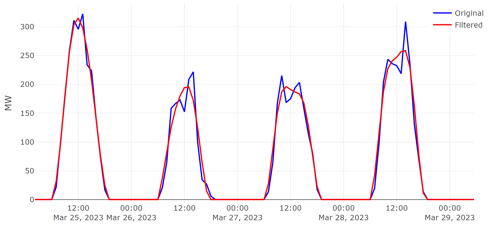

# solar-prettysignal
Transformando sinais ruidosos em curvas claras e precisas para Mini e Micro Geração Distribuída (MMGD).

## Contexto
Você não tem acesso às medições de geração fotovoltaica e precisa lidar com estimativas de MMGD. Para estimar a potência que foi gerada em cada horário do dia, você lança mão dos dados verficados de irradiação solar disponíveis das estações meteorológicas e tenta levantar o montante de potência instalada. Nessa hora, você descobre que os dados verificados de irradiação solar possuem algumas falhas e, muito provavelmente, o resultado final da sua estimativa não vai ficar interessante. Às vezes, você até já tem a curva medida da potência gerada pela sua usina fotovoltaica e mesmo assim enxerga variações abruptas ("dentes"). Essas variações podem ser causadas por falhas na aquisição de alguns dados ou por forte ruído incorporado ao sistema de sensoriamento e isso certamente prejudica qualquer trabalho de previsão futura que necessita da entrada desses dados.

Caso esteja passando por isso, conheça uma solução que resolve esses problemas: **Solar Pretty Signal**.

### Desafio

Os dados de irradiação solar podem ser inconsistentes e cheios de "dentes", devido às variações abruptas na irradiação ou falha do sistema de aquisição. Isso torna a precisão da análise um desafio significativo, prejudicando a confiabilidade dos insights extraídos desses dados.

### Solução

Com o Solar Pretty Signal, esses dados caóticos são transformados em sinais suaves e claros. Essa abordagem elimina os ruídos e irregularidades, preservando a integridade das informações essenciais do sinal original.

### Resultados

Os resultados falam por si. Comparado aos dados brutos, o sinal filtrado oferece uma representação muito mais precisa e utilizável das curvas de interesse. Não há mais os "dentes" perturbadores, apenas um fluxo contínuo e coerente de dados.



### Benefícios

- **Maior precisão**: Melhora significativa da qualidade dos dados para que eles possam ser utilizados em outros processos que os utilizam como entrada.
- **Facilidade de análise**: Sinais mais claros facilitam a análise e a tomada de decisões.

### Explore o Projeto

Explore o método. A seguir, um passo a passo de como você deve proceder para utilizar o **Solar Pretty Signal**.

## Começando (Versão Windows)

O **Solar Pretty Signal** é um pacote desenvolvido em linguagem R. Por isso, para utilizá-lo é preciso ter os seguintes programas instalados em sua máquina: 
* [R-4.3.0](https://cran.r-project.org/bin/windows/base/old/4.3.0/) para viabilizar a utilização do pacote. (esse pacote foi testato na versão R-4.3.0)
* [R Studio](https://posit.co/download/rstudio-desktop/) ambiente para visualizar, modificar e executar scripts em R (recomendado)

Após instação concluída com sucesso, abra o terminal do seu sistema e instale os seguintes pacotes:

```
install.packages(c("openxlsx", "data.table", "tidyr", "dplyr", "lubridate", "plotly", "shiny", "shinyjs"),
                  dependencies = TRUE)
```
Se você não é administrador de sua máquina, talvez, muitos desses pacotes não serão instalados com sucesso. É preciso contactar o administrador de seu sistema para ele seguir os passos de instalação.

### Baixe o pacote Solar Pretty Signal em sua máquina local
Baixe [este](https://github.com/robsondonato/solar-prettysignal) repositório em seu disco local:

1 - Clique em "Code" e depois em "Download ZIP".

2 - Extraia o conteúdo do arquivo ZIP para um diretório de sua escolha. O pacote de interesse é um dos arquivos extraídos desse ZIP, que é o arquivo nomeado de *solarprettysignal_0.1.0.tar.gz*

3 - Abra o RStudio.

Para instalar o pacote **Solar Pretty Signal** localmente (isto é, instalar o arquivo *solarprettysignal_0.1.0.tar.gz*), você pode usar a linha de comando no console do RStudio:

```
install.packages("caminho_para_o_pacote/solarprettysignal_0.1.0.tar.gz", repos = NULL, type = "source")
```
Substitua "caminho_para_o_pacote" pelo caminho onde o pacote está localizado.

### Utilizando os exemplos no RStudio
Uma vez que o pacote está instalado, você já pode acessar e executar os exemplos fornecidos. Aqui está o passo a passo para abrir um exemplo:

```
# Carregue o pacote
library(solarprettysignal)

# Lista os exemplos disponíveis
examples_names <- list_solar_prettysignal_examples()
print(examples_names)

# Abre o primeiro exemplo no editor do RStudio
run_solar_prettysignal_example(examples_names[1])
```
Isso abrirá no editor do RStudio um dos exemplos que vem integrado ao pacote *solarprettysignal_0.1.0.tar.gz*. A partir dai você poderá visualizar e executar o código exemplo e, na sequência, customizá-lo para atender as suas necessidades.

## Status do Projeto
> Status do Projeto: Concluído :white_check_mark:

---

